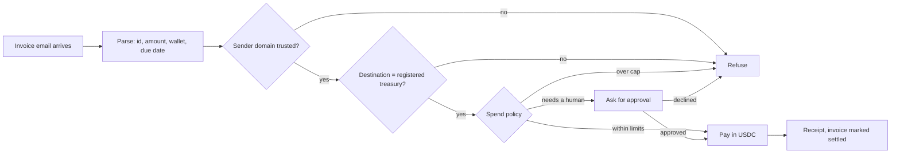
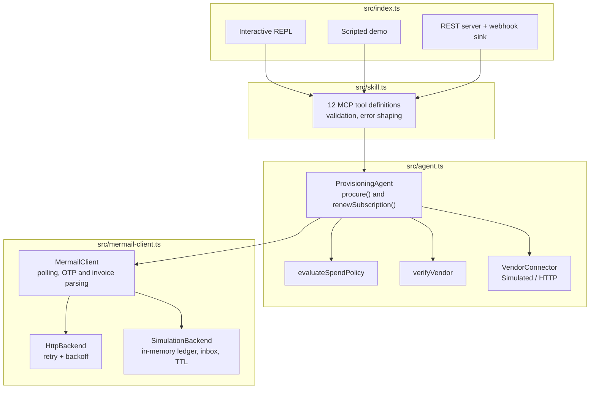
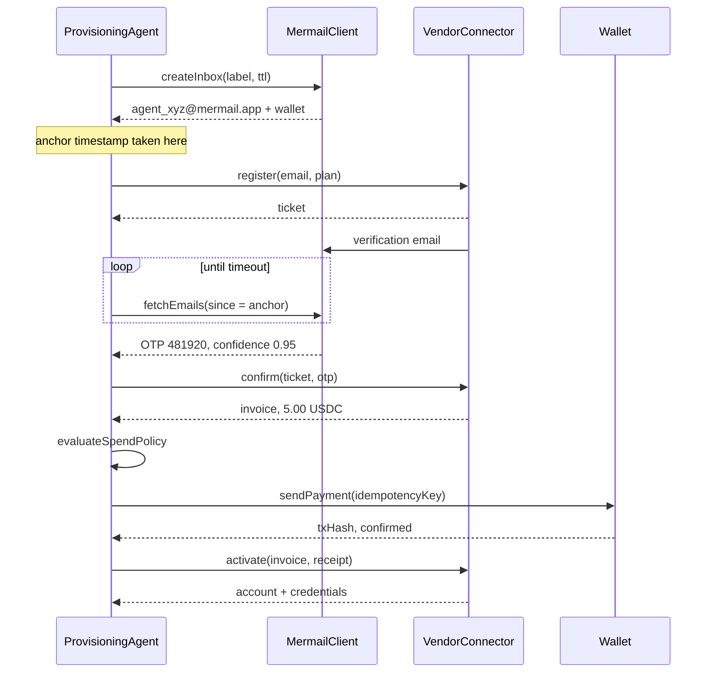

# MAP-Skill

**Mermail Autonomous Procurement & Account Provisioner**

Built for the Superteam Earn challenge *"Build and Demo a Mermail Agent Skill"*, sponsored by [Mermail](https://mermail.app).

An agent that needs to sign up for something has two problems a language model cannot solve on its own: it has no email address to receive the verification code, and no way to pay the invoice at the end. MAP-Skill hands it both. Every identity is a scoped inbox at `agent_<label>_<suffix>@mermail.app` with a TTL, an optional webhook, and a USDC/SOL wallet sharing its scope. Twelve tools cover the path from "we need a Notion seat" to a working API key, and then the month after that when the renewal invoice lands.

The interesting part is not the mailbox. It is the two checks between an invoice and the wallet's signing key: a trusted-vendor list that matches on sender domain *and* destination wallet, and a spend policy the vendor has no say in. That is the difference between an agent that can buy things and an agent you would let near a treasury.

## The two workflows

```mermaid
graph TD
    Agent[Autonomous AI Agent] -->|1. Request inbox| MermailSDK[Mermail Skill Engine]
    MermailSDK -->|2. Provision identity| Inbox[agent_id@mermail.app]

    TargetService[External SaaS / Platform] -->|3. Verification email / invoice| Inbox
    Inbox -->|4. Webhook or polling| MermailSDK

    MermailSDK -->|5. Extract OTP / parse invoice| Parser[Email and token parser]
    Parser -->|6. Verified action| Agent

    Agent -->|7. Authorize micro-payment| Wallet[Agent embedded wallet]
    Wallet -->|8. Settle in USDC / SOL| TargetService
```

**Use case 1, automated account registration.** Create an inbox, submit a signup, wait for the verification mail, extract the OTP or magic link, confirm, settle the invoice, collect the credentials.

**Use case 2, autonomous subscription renewal.** A billing email lands in an existing inbox. The agent parses it, verifies the sender against a trusted-vendor list, applies the spend policy, and only then signs.



Nothing in either chain requires credentials to try. With no `MERMAIL_API_KEY` set, everything runs against an in-memory simulator that mints addresses, delivers plausible verification and billing emails from a fake vendor, and settles payments against a fake ledger.

## Quick start

```bash
npm install
npm run demo
```

The demo runs both workflows and then tries a third thing: a spoofed invoice, same vendor name and sender domain, different destination wallet. It gets refused.

```
Use case 1: register with Acme Analytics and pay for the "starter" plan
  [ ok ] create_inbox       agent_acme_analytics_starter_htrlgq@mermail.app (K91gqqi3...)  (1ms)
  [ ok ] vendor_register    Acme Analytics ticket tkt_100001  (0ms)
  [ ok ] wait_for_otp       otp at 0.95 confidence, expires 2026-09-01T21:49:21.255Z  (1ms)
  [ ok ] vendor_confirm     INV-100001 for 5.000000 USDC  (1ms)
  [ ok ] policy_check       within budget and policy (5.000000 USDC)  (0ms)
  [ ok ] payment            5.000000 USDC to AcmeAnaLyt1csTreasury...  (0ms)
  [ ok ] vendor_activate    Acme Analytics account acct_100001 on starter  (0ms)

Use case 2: a renewal invoice arrives by email and gets settled
  [ ok ] await_invoice      INV-100002 from acme-analytics.example  (8ms)
  [ ok ] parse_invoice      5.000000 USDC to AcmeAnaLyt1csTreasury... at 1.00 confidence  (0ms)
  [ ok ] verify_vendor      Acme Analytics matched on domain and treasury  (0ms)
  [ ok ] policy_check       within budget and policy (5.000000 USDC)  (0ms)
  [ ok ] payment            5.000000 USDC to AcmeAnaLyt1csTreasury... (nz89z6Y8kG7p...)  (0ms)

A spoofed invoice from the same vendor name, paid to a different wallet:
  [ ok ] await_invoice      INV-SPOOF from acme-analytics.example  (0ms)
  [ ok ] parse_invoice      5.000000 USDC to AttackerWa11et... at 1.00 confidence  (0ms)
  [FAIL] verify_vendor      Invoice from Acme Analytics asks for payment to AttackerWa11et...,
                            which is not their registered treasury  (0ms)
```

Requires Node 20.11 or newer. The only dependencies are TypeScript and `@types/node`, both dev-only; nothing ships at runtime.

### Going live

Copy `.env.example` to `.env` and fill in a key. The moment `MERMAIL_API_KEY` is present the client swaps `SimulationBackend` for `HttpBackend` and starts talking to the real API. Set `MERMAIL_MODE=simulation` to pin it back to the simulator without deleting the key, which is what you want for a dry run.

Three settings deserve a second look before you switch:

`MERMAIL_NETWORK` defaults to `solana-mainnet` in live mode. On mainnet the faucet is disabled and the agent's auto-funding step turns itself off, so wallets have to be topped up from your treasury. Use `solana-devnet` while you are still wiring things up.

`AGENT_WALLET_KEY` is the signing handle. It goes out only on the routes that move money, never appears in a tool result, and is not written into any log line in this repo. Keep it out of git; `.gitignore` already covers `.env`.

`MAP_MAX_PER_TX_USD` and friends are the actual guardrail. They default to 25 USD per transaction and 100 USD per agent session, which is deliberately small.

## Architecture



The layer boundary that matters is `MermailBackend`. `HttpBackend` and `SimulationBackend` implement the same interface, so every layer above them is identical in both modes. There is no `if (testing)` anywhere in the agent or the tools.

`VendorConnector` is the second seam. `SimulatedVendor` writes real-looking verification and billing emails into the simulated inbox and trades a correct code for an invoice; `HttpVendorConnector` posts to a vendor's signup API. Most vendors have no such API today, so in practice you will write a connector that drives their flow with a browser and keeps this interface.

### One registration run, in detail



The anchor timestamp is there for a reason. Without it, a run can satisfy itself with a verification code from an *earlier* signup that is still sitting in the mailbox, which is a fun bug to debug at 2am. The renewal path has the equivalent problem in a nastier form: a settled invoice stays in the inbox forever, so the agent keeps a set of invoice ids it has already paid and skips them.

## Tools

| Tool | Writes | What it does |
| --- | --- | --- |
| `mermail_create_inbox` | yes | Mint an inbox and wallet, with TTL and webhook. One per vendor keeps a leak contained. |
| `mermail_list_inboxes` | no | Everything provisioned, with status, expiry and balances. |
| `mermail_fetch_emails` | no | Newest messages first, filterable by sender, subject, unread and attachments. |
| `mermail_wait_for_otp` | no | Block until a code or magic link arrives, with confidence and stated expiry. |
| `mermail_parse_invoice` | no | Pull id, amount, wallet and due date out of a billing email. Reads only. |
| `mermail_pay_invoice` | yes | Settle a parsed or supplied invoice, after vendor and policy checks. |
| `mermail_send_email` | yes | Reply from the inbox, for flows that need it. |
| `mermail_wallet_balance` | no | Address, network, per-currency balances. |
| `mermail_wallet_fund` | yes | Faucet top-up. Simulation and devnet only. |
| `mermail_wallet_pay` | yes | Direct transfer, policy-checked like everything else. |
| `mermail_procure_subscription` | yes | Use case 1 in one call. |
| `mermail_renew_subscription` | yes | Use case 2 in one call. |

Every handler returns `{ content, structuredContent, isError }` rather than throwing. A model that gets `"label" is required and must be a non-empty string` back can fix its own call; a model that gets an exception loses the turn.

Wiring the tools into an MCP server is three lines, since `toMcpTools()` already returns the `tools/list` shape:

```ts
const skill = new MermailSkill(new MermailClient());
server.setRequestHandler(ListToolsSchema, () => ({ tools: skill.toMcpTools() }));
server.setRequestHandler(CallToolSchema, (req) => skill.callTool(req.params.name, req.params.arguments));
```

The same definitions work unchanged in a plain function-calling loop, so LangChain, Eliza, Antigravity and AutoGPT all take them as they are.

## Guardrails

Two independent checks stand between an invoice and a signature.

**Trusted vendors.** An attacker who knows the agent's address can send a well-formed invoice email. Matching the sender domain alone does not help, because the From header is trivially forged and the payment destination is what actually matters. So `verifyVendor` requires both: the sender domain must be on the list, and the destination wallet must equal the treasury registered for that vendor. An optional `maxPerInvoiceUsd` caps each vendor separately.

```ts
const trustedVendors = [
  { name: 'Acme Analytics', senderDomain: 'acme-analytics.example', treasury: acmeTreasury, maxPerInvoiceUsd: 15 },
];
```

`mermail_pay_invoice` refuses outright to pay a parsed invoice with no trusted-vendor list attached, since that would mean sending money to an address that came out of an email.

**Spend policy.** Four checks run before any signature, in this order: currency allowlist, recipient allowlist (optional), per-transaction cap, session total, then the approval threshold.

```ts
const agent = new ProvisioningAgent(client, {
  policy: {
    maxPerTransactionUsd: 25,
    maxTotalUsd: 100,
    requireApprovalAboveUsd: 10,
    allowedCurrencies: ['USDC'],
    allowedRecipients: [acmeTreasury],
  },
  onApprovalRequired: async (invoice, reason) => askOperator(invoice, reason),
});
```

A violation is fatal to the run. Crossing the approval threshold is not: if `onApprovalRequired` is wired up it gets called, and the run continues or stops on the answer. With no handler installed, anything above the threshold fails with `approval_required`, which is the right default for an unattended agent.

Payments carry an idempotency key derived from the inbox and the invoice, so a retried network call cannot double-pay. Direct transfers accept your own key for the same reason.

## Interactive CLI

```bash
npm run repl
```

```
map> provision notion-trial
agent_notion_trial_k2xp9q@mermail.app [active] | expires 2026-09-02T21:40:06.260Z | wallet 8xKq... | 0.000000 USDC

map> procure starter
Acme Analytics account acct_100001 is live on the starter plan.
Mailbox: agent_acme_analytics_starter_naewaw@mermail.app
Paid 5.000000 USDC for invoice INV-100001 (tx EDnYgntgHRXYJf89...)
Credential keys: apiKey, dashboard

map> bill inb_a1b2c3d4 5
Invoice delivered.

map> invoice inb_a1b2c3d4
INV-100002: 5.000000 USDC to AcmeAnaLyt1csTreasury..., from acme-analytics.example, due 2026-09-08 (confidence 1.00)

map> renew inb_a1b2c3d4
Settled INV-100002 from Acme Analytics: 5.000000 USDC to AcmeAnaLyt1csTreasury.... Tx kmGxeSgymyEm8x3d...

map> policy
{ "maxPerTransactionUsd": 25, "maxTotalUsd": 100, ... }
spent this session: ~10.00 USD
```

`emails <id>`, `wait <id>`, `balance <id>`, `fund <id> <amount>`, `expire <id>` and `pay <id> <to> <amount>` do what they look like. `call <tool> <json>` drops to raw tool arguments when you want to test a schema directly:

```
map> call mermail_fetch_emails {"inboxId":"inb_a1b2c3d4","limit":3}
```

The REPL accepts piped input too, which makes it usable in a shell script:

```bash
printf 'provision ci-check\ninboxes\nexit\n' | node dist/src/index.js repl
```

## REST server

```bash
npm run serve   # PORT=8787 by default
```

```
GET  /health
GET  /tools                          tool catalogue in MCP shape
POST /tools/:name                    call any tool, body is the arguments object
GET  /inboxes
POST /inboxes                        { "label": "notion-trial", "ttlSeconds": 3600 }
GET  /inboxes/:id/messages?limit=10
POST /webhooks/mermail               inbound mail delivery
POST /procure                        { "plan": "starter", "budgetUsdc": "20" }
POST /renew                          { "inboxId": "...", "trustedVendors": [...] }
```

```bash
curl -s localhost:8787/procure -X POST \
  -H 'content-type: application/json' \
  -d '{"plan":"team","budgetUsdc":"20"}' | jq '.content[0].text'
```

The webhook route is the push half of the polling loop. In live mode Mermail posts inbound mail there; against the simulator it is how an external script injects a message without going through the CLI:

```bash
curl -s localhost:8787/webhooks/mermail -X POST \
  -H 'content-type: application/json' \
  -d '{"inboxId":"inb_a1b2c3d4","from":"billing@vendor.example",
       "subject":"Invoice INV-9","text":"Amount due: 1 USDC\nPay to: <address>"}'
```

Bodies are capped at 256 KB and errors return a message with no stack trace or internal path attached. There is no authentication on this server. It binds to `127.0.0.1` for that reason, and putting it on a public interface without a proxy in front would be a mistake.

## Writing a vendor connector

Three methods, all returning `Result`:

```ts
class MyVendor implements VendorConnector {
  readonly name = 'My Vendor';

  async register(input: VendorSignupInput): Promise<Result<VendorSignupTicket>> {
    // start the signup, return whatever handle you need later
  }

  async confirm(ticket: VendorSignupTicket, verification: ParsedVerification): Promise<Result<Invoice>> {
    // verification.otp or verification.activationLink; hand it back, get a price
  }

  async activate(invoice: Invoice, receipt: PaymentReceipt): Promise<Result<VendorAccount>> {
    // prove payment with receipt.txHash, collect credentials
  }
}

skill.registerVendor(new MyVendor());
```

Anything that fails should return `fail('vendor_rejected', ...)` rather than throw. The agent records the failure as a step, stops before the payment, and hands the caller a log of how far it got.

## Parsing

`parseVerification` scores candidates instead of grabbing the first six digits it finds:

| Pattern | Confidence |
| --- | --- |
| Digits next to the word code, OTP, PIN, passcode or token | 0.95 |
| A URL containing verify, confirm, activate, magic or validate | 0.90 |
| Six digits alone on a line | 0.70 |
| Any other URL | 0.40 |

Links matching `unsubscribe`, `preferences` or `privacy` are dropped outright, and a stated window like "expires in 10 minutes" is turned into an absolute `expiresAt`. The default floor is 0.6, so the last row never auto-submits.

`parseInvoice` needs an amount with a currency and a destination address; without both it returns `parse_failed` rather than guessing. An invoice id and a due date each add to the confidence score. Both parsers are heuristics and will be wrong sometimes, which is exactly why the score is returned rather than swallowed.

## Layout

```
src/types.ts            MermailInbox, EmailMessage, ParsedVerification, PaymentIntent,
                        Result, money arithmetic, errors
src/mermail-client.ts   config, HTTP backend, simulator, polling, OTP and invoice parsing
src/skill.ts            12 tool definitions, argument validation, result shaping
src/agent.ts            spend policy, vendor verification, both workflows, connectors
src/index.ts            CLI, demo, REST server, webhook sink
test/skill.test.ts      78 tests
```

## Spec coverage

| SPEC.md calls for | Where it lives |
| --- | --- |
| `MermailInbox` with address, TTL, webhook, status | `types.ts`, enforced in `SimulationBackend` |
| `EmailMessage` with attachments | `types.ts`, filterable via `EmailFilter.hasAttachments` |
| `ParsedVerification` with OTP, link, expiration | `parseVerification` in `mermail-client.ts` |
| `PaymentIntent` with memo, txHash, status | `types.ts`, settled by `sendPayment` |
| `createInbox` / `fetchEmails` / `waitForVerification` / `sendPayment` | `MermailClient` |
| Simulated mode | `SimulationBackend`, selected whenever no API key is set |
| `mermail_create_inbox` / `wait_for_otp` / `parse_invoice` / `pay_invoice` | `skill.ts`, plus eight more |
| Automated account registration | `ProvisioningAgent.procure` |
| Autonomous subscription renewal | `ProvisioningAgent.renewSubscription` |

## Tests

```bash
npm test         # build, then node --test
npm run typecheck
```

The suite runs entirely in-process and takes about 350ms. Timeout paths use an injected clock rather than real waiting, so there is nothing flaky about the polling tests. Coverage is on the parts that would actually cost money: decimal handling, insufficient funds, idempotency replay, every branch of the spend policy, invoice spoofing, extraction false positives, TTL expiry, and paying the same invoice twice.

## Known limits

Money conversion to USD uses a hardcoded reference rate for SOL, which is fine for a policy check on a 5 USD invoice and wrong for anything larger. Wire in a price feed before you allow SOL-denominated invoices.

The simulator's ledger has no notion of confirmation latency, reorgs, or a payment that lands in `pending` and stays there. Live integration testing on devnet is not optional.

Invoice parsing handles plain-text bodies. An HTML-only invoice, or one that puts the amount in a PDF attachment, will not parse.

`HttpVendorConnector` assumes a JSON signup API. Very few vendors have one.

## License

MIT. See [LICENSE](./LICENSE).
